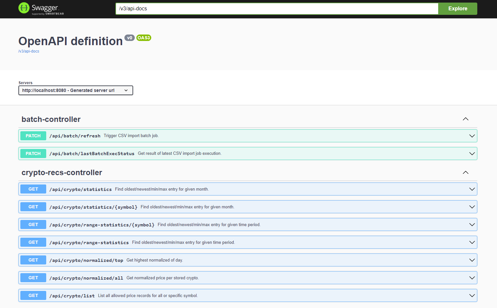

# Crypto Investment Recommendation service
## Overview
Service providing requested REST API endpoints.

Data are parsed from CSV files by Spring Batch, 
persisted on datasource (for dev/test purpose shipped with H2 in-memory database in h2 profile) and served by 
Spring REST API.

* [Spring Batch Docs](https://docs.spring.io/spring-batch/docs/current/reference/html/index.html)
* [Spring Web Docs](https://docs.spring.io/spring-boot/docs/current/reference/html/web.html)

## REST API Docs
[SpringDoc OpenAPI 3](https://springdoc.org/v2/) is used within a project, to review exposed endpoints, visit 
_HOST:PORT/swagger-ui.html_ of service instance to get Swagger UI.

Example:



## Running in Docker and Kubernetes
To create Docker Image, project is using [Google Jib Gradle Plugin](https://github.com/GoogleContainerTools/jib/tree/master/jib-gradle-plugin).

Following Gradle tasks are available:
* _jib_
* _jibBuildTar_
* _jibDockerBuild_

To **publish** image into registry, run Gradle with project property.``project.findProperty('docker_registry')`` is used as registry part of image name.

To **create an image locally** run *jibDockerBuild*.

To **create image tar locally**, run *jibBuildTar* to get tarball, which can be used on host with docker by ``docker load`` command.


## Service CSV Source
Service CSV processing is done by Spring Batch job. CSV files are loaded based on following properties:
````
input:
  headers: "timestamp,symbol,price"
  sourceDir: "path/to/source/dir"
  pattern: "*_values.csv"
````

CSV reading Job is looking for resources on given path with given pattern for each job execution.

### Processing overview
Spring Batch job is triggered during application start up, but can be restarted by calling REST API endpoint as well as it is possible to check latest job execution state/result.

**Batch CONS** Triggering CSV import job endpoint should be used only when it is really needs. In real world, endpoint should be restricted or moved with whole CSV import process into separated service. 

### Externalize CSV source when running in Docker container
If you are running one or multiple service instances in containers, using **Docker Volume** can help you to have one location for source CSV files.
Run container with mounted volume and set it correctly as ``input.sourceDir`` property.

